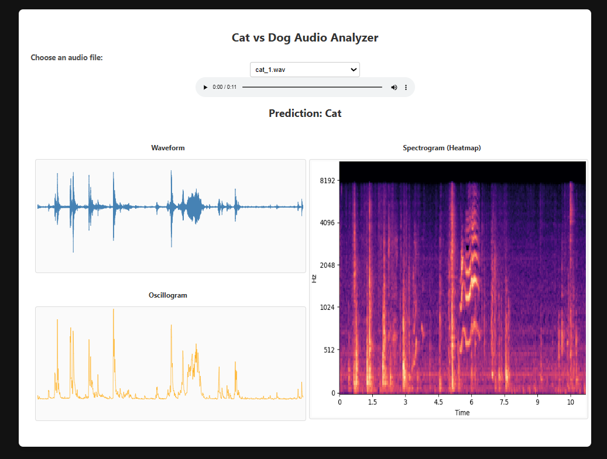

# Cat vs. Dog Sound Analysis

An interactive web-based application for visualizing and classifying cat and dog vocalizations through audio analysis. Built as a final project for CPSC 5320 – Visual Analytics (SQ25).

**Authors:** Marlin Banh, Yunsung Choi, Aarti Dashore

## Motivation

Few studies focus on visualizing pet vocalizations. This project aims to reveal patterns in loudness, amplitude, and frequency across cat and dog sounds, and to make those patterns accessible through an intuitive, web-based interface.

### Main Questions

- Can we classify cat and dog sounds from audio alone?
- How do loudness, amplitude, and frequency vary between the two?
- Is the interface intuitive for end-users?

## Dataset

**Audio Cats and Dogs** by Naoya Takahashi, Michael Gygli, Beat Pfister, and Luc Van Gool.

- ~300 cleaned WAV files of cat and dog sounds
- Sampled at 16 kHz, with variable lengths
- Pre-processed and split into training and testing sets

## Intended Audience

- **Zoologists & Animal Researchers** – to understand vocalization patterns in animals
- **Pet Owners & Trainers** – to better interpret pet sounds for improved care
- **AI Developers & Data Scientists** – to enhance sound classification models

## Related Work

Existing tools for animal sound analysis include WASIS (Wildlife Animal Sound Identification), SoundHound, and BirdNET.

**What sets this project apart:**

- Web-based access from any device, no installation required
- Combines sound visualization with real-time classification

## Methodology

### Classification

Audio is classified as "Cat" or "Dog" using **MFCC (Mel-Frequency Cepstral Coefficients)** features, extracted through the following pipeline:

1. **Windowing** – apply a window function to reduce signal edge effects
2. **Fast Fourier Transform** – convert the signal to its frequency spectrum
3. **Mel Filterbank** – apply triangular filters spaced according to the Mel scale
4. **Logarithm** – take the log of the filterbank energies
5. **Discrete Cosine Transform** – reduce dimensionality into a fixed-size feature vector

The resulting feature vectors (input X) are fed into a **Random Forest** classifier, which predicts and displays the label (target Y).

### Audio Visualizations

Three complementary visualizations are provided for each audio sample:

| Analysis | Description | Why it's useful |
|---|---|---|
| **Waveform** | Loudness over time | Visualizes sound intensity and sharp transitions |
| **Oscillogram** | Short-term energy variations | Highlights rhythmic patterns and sudden bursts |
| **Spectrogram** | Frequency vs. time representation | Visualizes the frequency distribution |

## Design Rationale

- **Dataset:** The Audio Cats and Dogs dataset offers a large, pre-processed collection of labeled audio split into training and testing sets.
- **Multiple analysis views:** Combining waveform, oscillogram, and spectrogram views gives a richer picture of loudness, frequency, and energy variation.
- **Web-based application:** A browser-based tool makes the analysis accessible to non-technical audiences without requiring any coding knowledge.

## Key Insights

**Amplitude Pattern Differences**
- Dog sounds show distinct, high-amplitude peaks recurring at regular intervals, indicating strong, short bursts.
- Cat sounds show mid-level amplitude peaks with gradual rise-and-fall cycles, indicating smooth, continuous energy flow.

**Frequency Distribution Differences**
- Dog sounds concentrate energy around 500–1500 Hz, with repetitive low-frequency bursts.
- Cat sounds show greater high-frequency content above 2000 Hz, appearing as long tonal ridges in the spectrogram.

**Short-Term Energy (Oscillogram) Features**
- Dog sounds show evenly spaced energy spikes, reflecting a repetitive barking pattern.
- Cat sounds show irregular spike intervals and varying magnitudes, reflecting more diverse vocalizations.

## Output
](https://github.com/AartiDashore/CatDogAudioTextImplementation/blob/main/Output.png)

## Tech Stack

- HTML
- CSS
- JavaScript
- [D3.js](https://d3js.org/)
- Python (audio feature extraction and Random Forest classification)

## Features Summary

1. **Classification Model** – identifies whether an uploaded/selected audio file is a "Cat" or a "Dog."
2. **Audio Analysis** – waveform graphs show sound intensity and structure, while spectrograms visualize sound characteristics.
3. **User-Friendly Design** – a web-based application that requires no downloads or coding knowledge to use.

## Project Context

This project was developed for **CPSC 5320 – Visual Analytics (SQ25)**.
